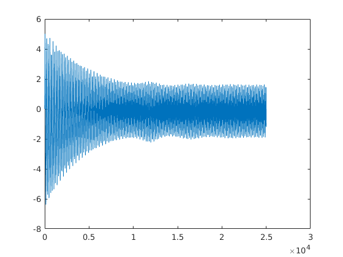
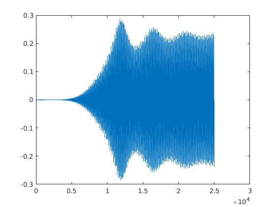

# MATH 4540 - Final Project

Liam Fruzyna

#### #1 As discussed in the textbook, add a wind force to model DEs.

$y'' = -dy' - \frac{K}{ma} (e^{a(y - lsin\theta)} - 1 + e^{a(y + lsin\theta)} - 1) + 0.2W sin(2\pi \frac{38}{60} t)$

$\theta'' = -d\theta' + \frac{3cos\theta}{l} \frac{K}{ma} (e^{a(y - lsin\theta)} - e^{a(y + lsin\theta)})$

#### #2 Convert the DEs into a system of first order DEs.

$y'' = -dy' - \frac{K}{ma} (e^{a(y - lsin\theta)} - 1 + e^{a(y + lsin\theta)} - 1) + 0.2W sin(2\pi \frac{38}{60} t)$

$\theta'' = -d\theta' + \frac{3cos\theta}{l} \frac{K}{ma} (e^{a(y - lsin\theta)} - e^{a(y + lsin\theta)})$

#### #3 Run tacoma.m with wind speed W = 80 km/hr and initial conditions $y = y' = \theta' = 0, \theta = 0.001$. The bridge is stable in the torsional dimension if small disturbances in $\theta$ die out; unstable if they grow far beyond original size. Which occurs for this value of W?

The bridge does not appear stable as the torsional disturbances increase over time at W = 80.

#### #4 Replace the trapezoid method by Euler's method and repeat #3.

Euler's method went wildly out of control, this is likely due to the much lower precision than the other methods.

#### #5 Replace the trapezoid method by fourth-order Runge-Kutta to improve accuracy. Also, add new figure windows to plot $y(t)$ and $\theta(t)$.

#### #6 The system is torsionally stable for W = 50 km/hr. Find the magnification factor for a small initial angle. That is, set $\theta(0) = 10^{-3}$ and find the ratio of the maximum angle $\theta(t), 0 \leq t < \inf$ to $\theta(0)$. Is the magnification factor approximately consistent for initial angles $\theta(0) = 10^{-4}, 10^{-5}, ...$?

Yes, the magnification factor does appear to be consistent as the angle increases.

| $\theta(0)$ | Magnification Factor |
| ----------- | -------------------- |
| $10^{-3}$   | 19.2941              |
| $10^{-4}$   | 19.1370              |
| $10^{-5}$   | 19.1354              |
| $10^{-6}$   | 19.1354              |
| $10^{-7}$   | 19.1354              |

#### #7 Find the minimum wind speed W for which a small disturbance $\theta(0) = 10^{-3}$ has a magnification factor of 100 or more. Can a consistent magnification factor be defined for this W?

The magnification factor appears to break 100 when the wind speed is at 59 km/hr.

When increasing $\theta(0)$ initially the magnification factor is not consistent, however, it appears to stabilize immediately.

| $\theta(0)$ | Magnification Factor |
| ----------- | -------------------- |
| $10^{-3}$   | 100.5742             |
| $10^{-4}$   | 75.3422              |
| $10^{-5}$   | 75.2238              |
| $10^{-6}$   | 75.2226              |
| $10^{-7}$   | 75.2226              |

#### #8 Try some larger values of W. Do all extremely small initial angles eventually grow to catastrophic size?

W = 80

| $\theta(0)$ | Magnification Factor |
| ----------- | -------------------- |
| $10^{-3}$   | 288.2504             |
| $10^{-4}$   | 137.0891             |
| $10^{-5}$   | 136.2340             |
| $10^{-6}$   | 136.2254             |
| $10^{-7}$   | 136.2254             |

W = 100

| $\theta(0)$ | Magnification Factor |
| ----------- | -------------------- |
| $10^{-3}$   | 362.5218             |
| $10^{-4}$   | 3646.4415            |
| $10^{-5}$   | 34764.8323           |
| $10^{-6}$   | 19491.0314           |
| $10^{-7}$   | 19211.5771           |

Using a smaller initial angle does help improve the stability, but with a large enough wind speed it can still grow catastrophically.

#### #9 What is the effect of increasing the damping coefficient? Double the current value and compare the critical A when $\omega = 3$. Can you suggest possible changes in design that might have made the bridge less susceptible to torsion?

At W = 80 km/hr, a damping coefficient of 0.02 successfully prevents the torsion from going out of control. This results in a magnification factor of 16.9693. Stiffer cables with twice the damping power would have improved the situation.

#### EC: Design and implement a method for computing the minimum wind speed in #7, to within $0.5x10^{-3}$ km/hr. You may want to use an equation solver from Chapter 1.

 