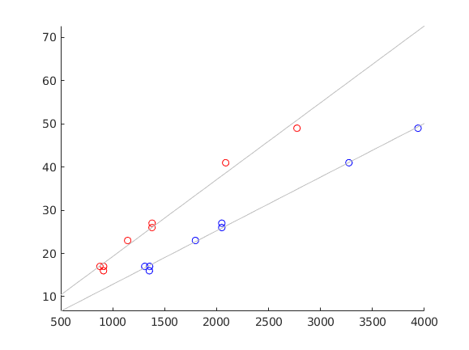

Liam Fruzyna

## 2. Plot W versus l\*l\*g to ascertain the appropriateness of this model. Comment on the result compared to the model W proportional to l\*g\*g presented in the text.

Note: the red line is the existing l\*g\*g model and the blue line is the new l\*l\*g model.

Both models appear very linear, because of this the slope shouldn't matter because the k value of the model will adjust it accordingly. However, the new model appears to be an improvement because the data is fitted tighter to the line than in the existing model.