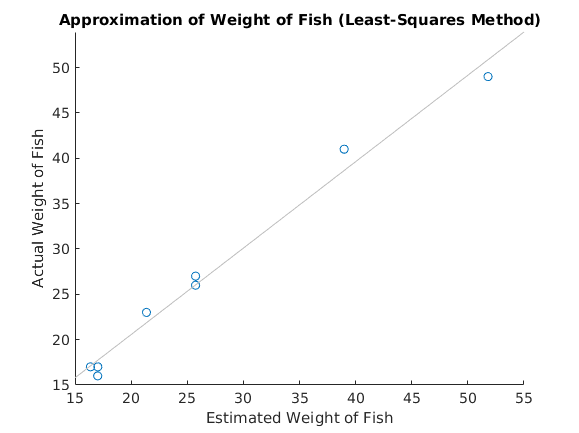

Liam Fruzyna

## 6. Repeat part 4. above using the model W = a\*l\*g\*g.

```matlab
% Dermine the least-squares estimate of k and plot

lengths = [14.5 12.5 17.25 14.5 12.625 17.75 14.125 12.615];
girths  = [9.75 8.375 11.0 9.75 8.5 12.5 9.0 8.5];
weights = [27 17 41 26 17 49 23 16];

x = lengths .* girths.^2;
y = weights;

xy = x .* weights;
x2 = x.^2;

a = sum(xy) / sum(x2)
estW = a .* x;

scatter(estW, weights);
title('Approximation of Weight of Fish (Least-Squares Method)')
xlabel('Estimated Weight of Fish')
ylabel('Actual Weight of Fish')
lsline
```


